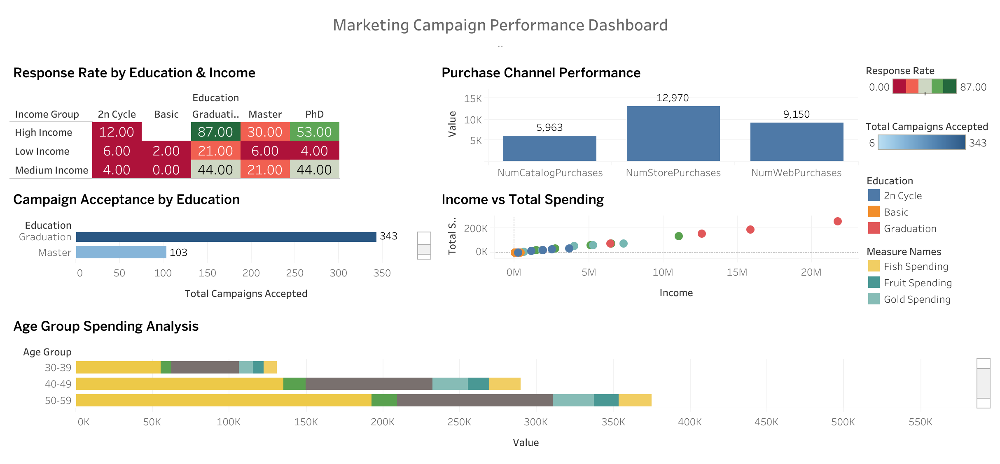

# Project 5: Marketing Campaign Dashboard (Tableau)

## 📊 Project Overview
Interactive marketing analytics dashboard analyzing 2,240 customer records to identify high-value segments, optimize campaign ROI, and improve channel performance through data-driven insights.

**Dashboard Link:** [🔗 View Live Dashboard on Tableau Public](https://public.tableau.com/app/profile/onur.ayd.nda./viz/Marketing_Campaign_Analysis_17664064247640/MarketingCampaignPerformanceDashboard)

---

## 📈 Dashboard Preview

*Interactive dashboard featuring 5 analytical visualizations with customer segmentation insights*

---

## 🎯 Objectives
- Identify high-response customer segments
- Analyze purchase channel effectiveness
- Optimize marketing spend allocation
- Provide actionable segmentation insights

## 🛠️ Tools Used
- **Tableau Public** - Dashboard development and hosting
- **Calculated Fields** - Custom metrics creation
- **Interactive Filters** - Dynamic data exploration

## 📁 Dataset
- **Source:** Marketing Campaign Dataset (Kaggle)
- **Records:** 2,240 customers
- **Attributes:** 29 variables (demographics, spending, campaign responses)
- **Product Categories:** Wine, Meat, Fish, Sweets, Fruits, Gold
- **Channels:** Store, Web, Catalog

## 📈 Dashboard Components

### Visualizations (5)

**1. Response Rate Heatmap**
- Customer segmentation by education and income
- Key Finding: Graduation + High Income = 87% response rate
- Low performers: Basic education segments (0-21% response)

**2. Purchase Channel Performance (Bar Chart)**
- Channel comparison across Store, Web, Catalog
- Key Finding: Store purchases dominate (12,970 transactions)
- Web: 9,150 | Catalog: 5,963

**3. Campaign Acceptance by Education (Bar Chart)**
- Education-level campaign response analysis
- Key Finding: Graduation leads with 343 acceptances
- Master: 103 acceptances

**4. Income vs Total Spending (Scatter Plot)**
- Correlation analysis between income and spending
- Colored by education level
- Key Finding: Positive correlation with notable outliers

**5. Age Group Spending Analysis (Stacked Bar)**
- Spending breakdown by age demographics and product category
- Key Finding: 60+ age group = highest spenders (~550K)
- Wine category dominates all age groups

### Interactive Elements
- Education level filters
- Income group segmentation
- Product category legends
- Dynamic tooltips

## 🔍 Key Findings

**Golden Segment:** Graduation + High Income (87% response rate)  
**Top Channel:** In-store purchases (12,970 transactions)  
**Top Age Group:** 60+ customers (550K total spending)  
**Dominant Product:** Wine (leads across all segments)  
**Weakest Segment:** Medium Income + Basic Education (0% response)

## 📂 Files
- **Live Dashboard:** [Tableau Public Link](https://public.tableau.com/app/profile/onur.ayd.nda./viz/Marketing_Campaign_Analysis_17664064247640/MarketingCampaignPerformanceDashboard)
- `dashboard_screenshot.png` - Dashboard preview image
- Dataset: Marketing Campaign CSV (2,240 records)

## 💡 Skills Demonstrated
- Tableau Public proficiency
- Customer segmentation analysis
- Heatmap visualization
- Calculated field creation (age groups, income segments, response rates)
- Multi-chart dashboard design
- Interactive filter implementation
- Business insight generation
- Data storytelling

## 🚀 Business Recommendations

1. **Target Golden Segment:** Focus marketing spend on Graduation + High Income (87% response vs 0-21% baseline)
2. **Channel Strategy:** Prioritize in-store experience while optimizing web presence
3. **Product Focus:** Leverage Wine category dominance for cross-selling opportunities
4. **Age Targeting:** Develop premium offerings for 60+ demographic (highest spenders)
5. **Cost Optimization:** Reduce investment in low-performing segments (Basic education + Medium income)

## 📊 Technical Implementation

**Calculated Fields Created:**
- `Age` - Calculated from birth year (2024 - Year_Birth)
- `Age Group` - Segmented customers into 5 age brackets (18-29, 30-39, 40-49, 50-59, 60+)
- `Income Group` - Created Low/Medium/High income tiers (<30K, 30-60K, 60K+)
- `Total Campaigns Accepted` - Summed 5 campaign responses
- `Total Spending` - Aggregated spending across 6 product categories
- `Response Rate` - Campaign response percentage

**Visualization Techniques:**
- Red-Green diverging color palette for heatmap
- Stacked bar for product mix analysis
- Scatter plot for income-spending correlation
- Grouped bar for channel and campaign comparisons
- Interactive legends and filters for exploration

---

**Completed:** 22.12.2025  
**Tool:** Tableau Public  
**Live Dashboard:** [Interactive Version](https://public.tableau.com/app/profile/onur.ayd.nda./viz/Marketing_Campaign_Analysis_17664064247640/MarketingCampaignPerformanceDashboard)

[← Back to Portfolio](https://github.com/OnurAydindag/Data-Analyst-Portfolio)
